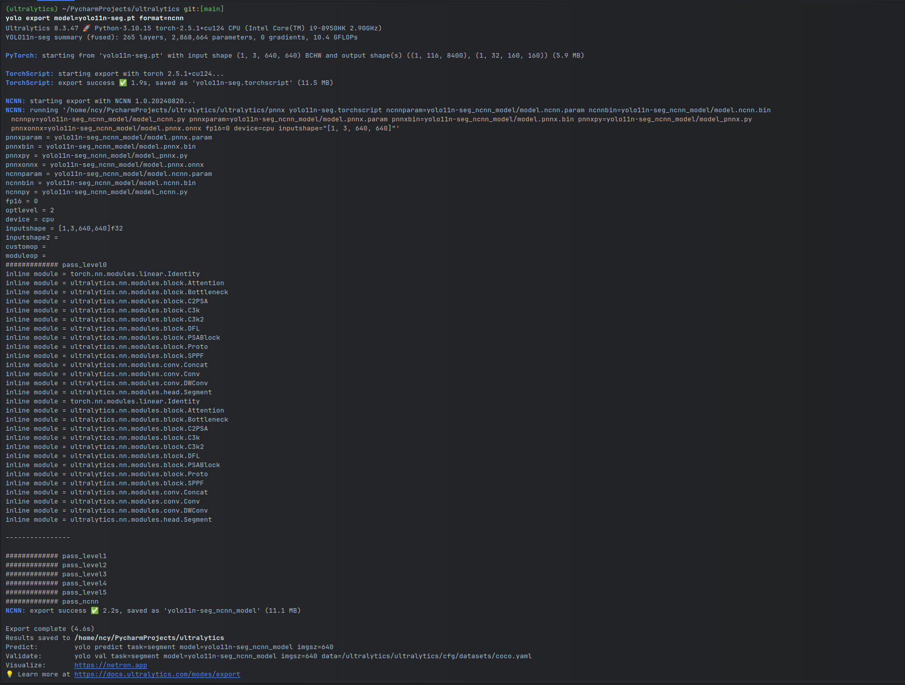

# ncnn-yolov8 detection and segmentation demo

The yolov8 object detection and segmentation

1.Android yolov8 detection demo  
2.yolov8s-seg.cpp  
3.yolov8s-obb.cpp  

## Export ncnn model
1.export detect model  
  
2.export seg model  
  
3.export detect-obb model   
  
## screenshot

## Reference：  
https://github.com/nihui/ncnn-android-nanodet  
https://github.com/Tencent/ncnn  
https://github.com/ultralytics/assets/releases/tag/v0.0.0  
https://github.com/facebookresearch/detectron2  
